# BabelJS

## L'Equipe :

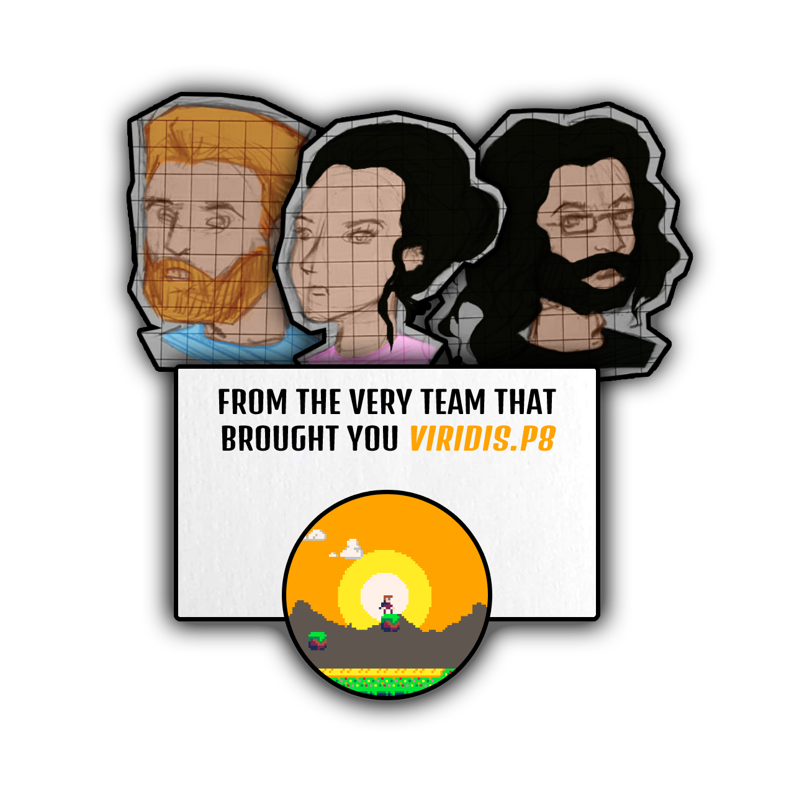
- Chihabeddine Aourinmouche :
- Enzo Rostaing :
- Soumarè Shérine : "*Si l'occulte ne me faisait pas peur, je serais devenue archéologue. Du coup faisons un jeu avec de la mythologie.*"

## L'histoire de BabelJS

Gilgamesh, premier souverain de la cité sumérienne Babylone cherche à rejoindre le sommet de la tour de Babel afin de s’assoir sur son trône et d’y être couronné.  

#### Point historique

L’histoire se déroule à une époque lointaine, l’ancienne Mésopotamie, entre le XVIII et XVII siècle avant J.C.
- Gilgamesh (𒄑𒂅𒈦) est un héros majeur dans la mythologie et protagoniste de l’ “Epopée de Gilgamesh”. Il était également l’un des grands rois de Uruk une cité sumérienne.
- Les aqrabuamelu sont des créatures apparaîssant dans l’Epopée de Gilgamesh. Elles sont décrites comme possédant une tête, un buste et des bras d’Hommes, un corps de scorpion et également pourvu d’ailes sur les parties inférieures de leur corps. Les aqrabuamelu sont les gardiens de portes du dieu soleil Shamash donnant accès aux Kurnugi, l’enfer de l’ancienne mésopotamie.
- Babylone est une cité antique de la mésopotamie. Elle est aujourd’hui un site archéologique majeur. Avec un rayonnement mondial, elle est aussi connu pour ses murailles qui pourrait avoir inspiré les mythes de la tour de Babel et des jardins suspendus.  
- La tour de Babel apparaît dans la mythe fondateur servant à expliquer pourquoi différents langages sont utilisés à travers le monde. La tour de Babel apparaît à la suite du Déluge auquel le sage Utnapishtim, personnage important de l’Epopée de Gilgamesh, aurait survécu.  

#### Scénario   
Le protagoniste débute son aventure à l’extérieur de la ville.
Après avoir eu une vision du rôle qui est le sien, c’est à dire régner sur Babylone, Gilgamesh s’est mis en route pour la cité.
Pour pouvoir prétendre au trône, Gilgamesh devra se montrer vertueux. Il prouvera sa valeur aux travers d'épreuves que les dieux auront mis sur sa route.  
La première étape de son périple sera de trouver son chemin du labyrinthe (Trouver un nom badass pour le labyrinthe). Cette épreuve envoyée par les dieux servira de catharsis à l'âme du souverain en devenir.
Après s'être purifié au travers de l'épreuve du labyrinthe, il lui sera possible d’entrer dans la cité qu’il aura à gouverner. En arpentant la cité et en apprenant ces particularités, il lui faudra trouver les clefs qui lui permettront d’ouvrir les portes gardées par les aqrabuamelu. (Préciser le nombre de clef)
Pour mettre fin à ce périple, Gilgamesh devra monter au sommet de la tour et s'asseoir sur le trône. Il sera alors jugé digne par les dieux et recevra la marque divine des grands souverains.

#### Déroulement du jeu

*Départ* : Entrée du labyrinthe (Peut être au début un labyrinthe souterrain, en dessous de la ville de Babylone)  
*Zone* : Cité sumérienne  
*The place to be* : Le trône de Gilgamesh

Différentes étapes :
- Trouver la sortie du labyrinthe
- Récupération des clefs pour entrer/sortir de la cité
- Rencontres avec les aqrabuamelu et gardien de la porte de la tour de Babel
- Montée de la tour de Babel

*Arrivée* : Sommet de la tour sur un trône  
*Finalité* : Gilgamesh participe à la renommée de la cité.

## Représentation du thème

Thème du concours : The place to be   
Ce thème transparait tout d'abord par la fin du jeu, le protagoniste ira s'assoir sur un trône, **le** trône où siège le souverain juste et bon.    
Nous pouvons aussi retrouvé ce thème dans la zone de jeu. Représentant la Mésopotamie au XVIII siècle avant J.C. il s'agit d'une des régions ayant connu le plus grand essors et le plus grand rayonnement.

## Illustrations et concept art

||||
|:-:|:-:|:-:|
|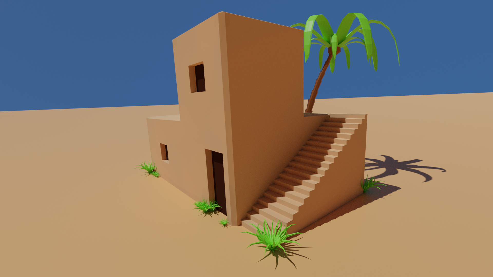|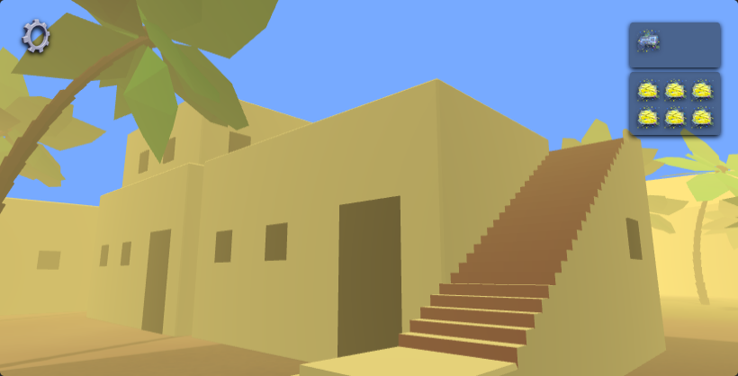|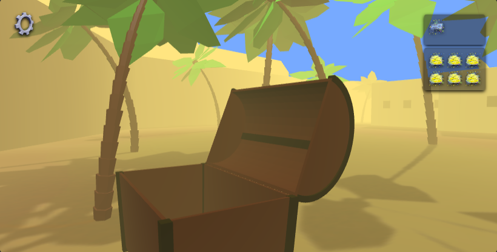|
|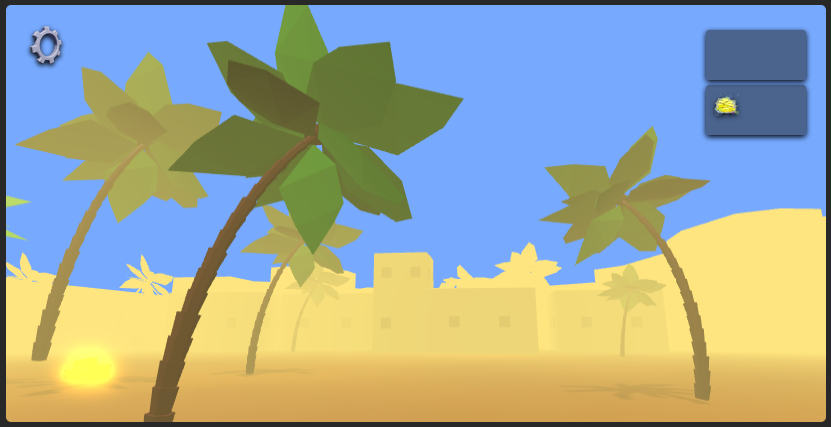|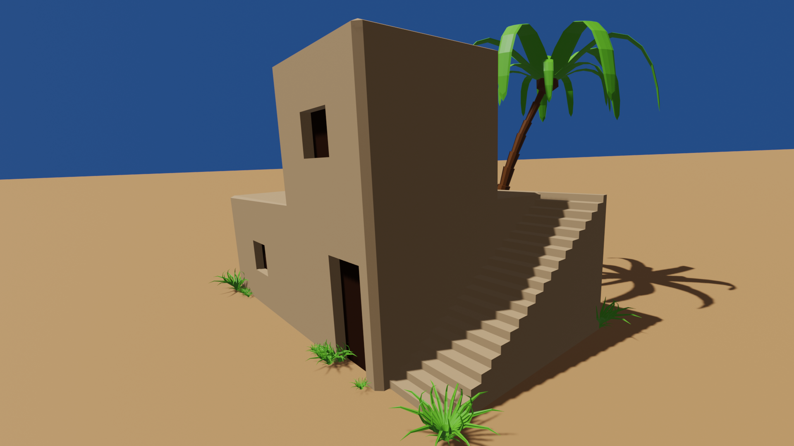|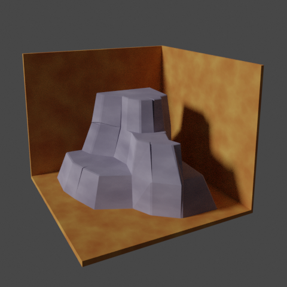|
|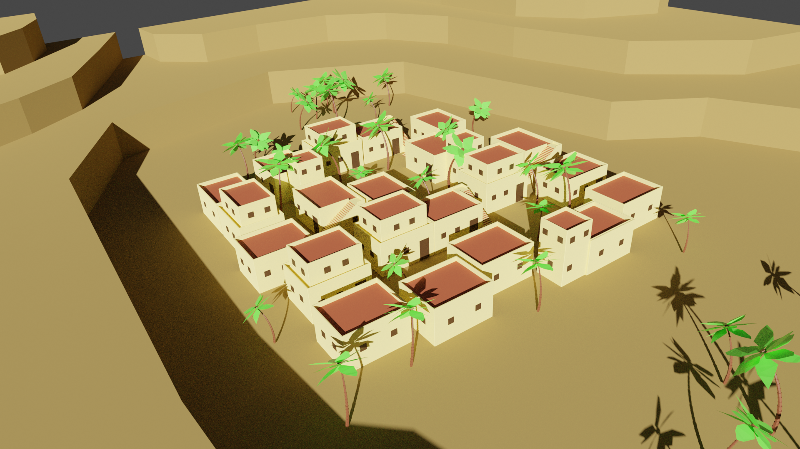|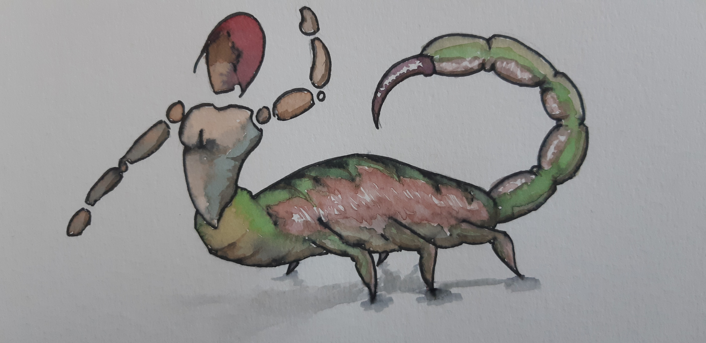|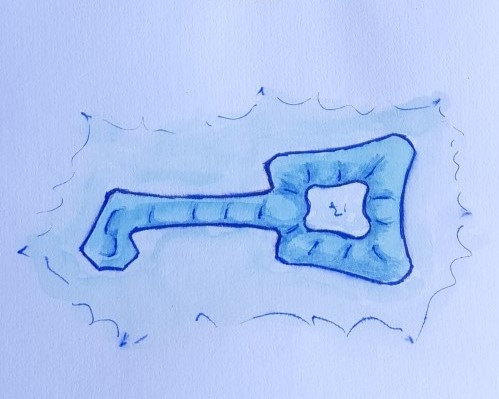|
|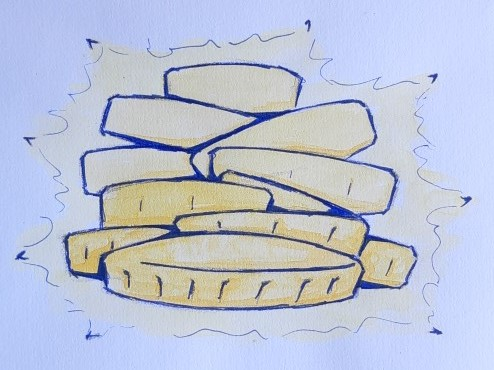|||

## Comment jouer

|||
|:-:|:-:|
|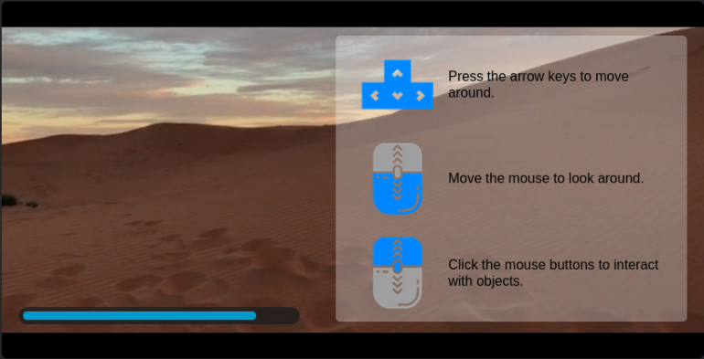|Cet écran présente les touches utilisées pour se déplacer et interagir avec les objets interactifs en attendant le chargement des ressources telles que les sons et les mesh.|
|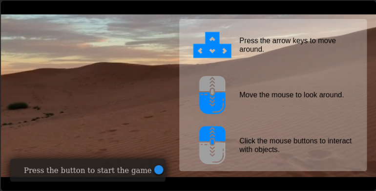|Lorsque toutes les ressources sont chargées, un message apparaît avec un bouton pour démarrer le jeu.|
|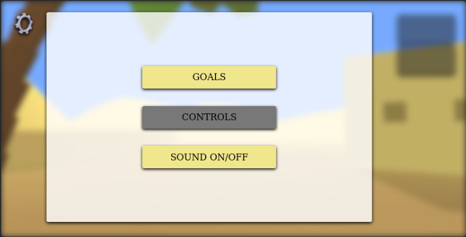|Le bouton en haut à gauche permet d'afficher le menu.|
|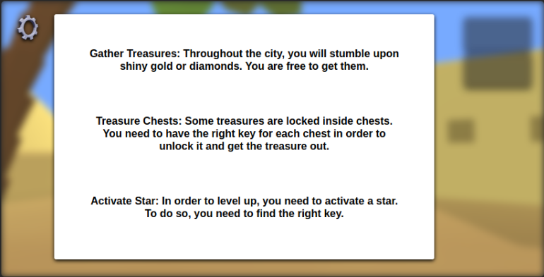|Dans le menu du jeu, cliquer sur le bouton "Goals" affiche une page listant les buts à atteindre pour finir le niveau actuel. Tous les buts ne sont pas nécessaires pour réussir le niveau.|
|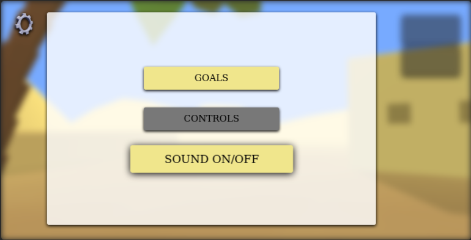|Le bouton "Sound ON/OFF" permet de couper le son ou de le remettre.|
|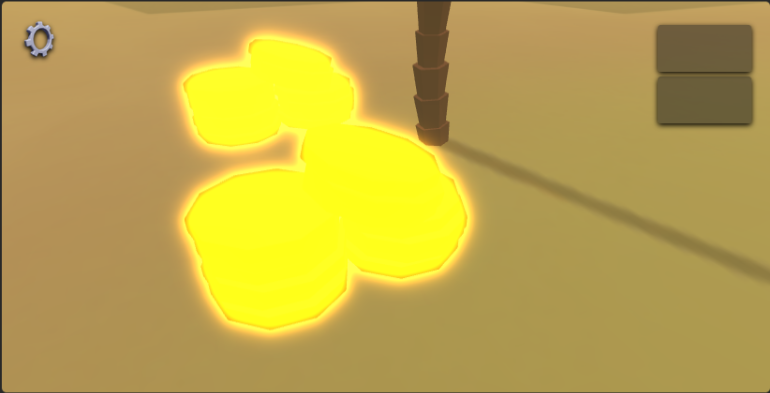|Un des buts est de trouver et d'accumuler les trésors cachés dans le jeu.|
|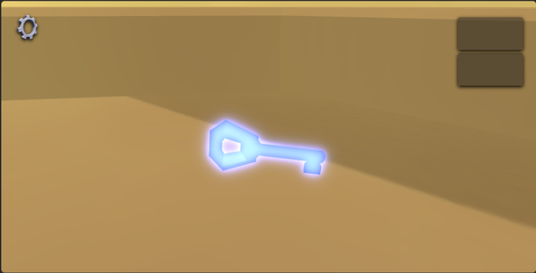|Certains trésors sont cachés dans des coffres qui sont fermés. Une clé est alors nécessaire pour ouvrir les coffres. Il faut chercher les clés et les récupérer.|
|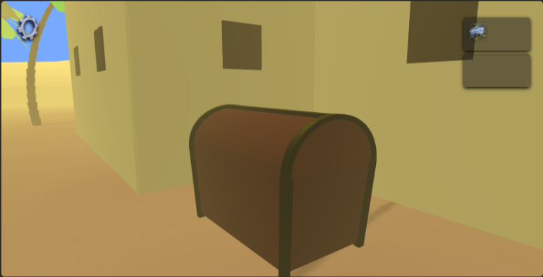|Les clés n'ouvrent pas n'importe quel coffre, chaque coffre à sa propre clé !|
|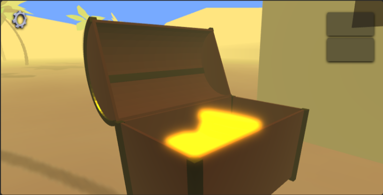|Lors de l'ouverture d'un coffre, le joueur peut récupérer le trésor caché à l'intérieur.|
|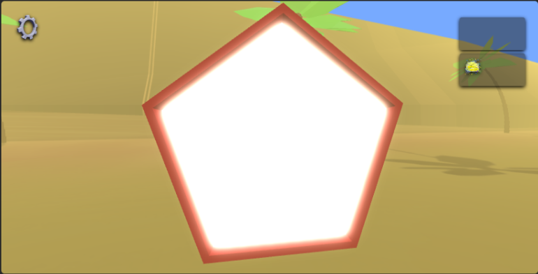|Cette étoile marque la fin du niveau. L'avoir activé envoie le joueur au niveau suivant.|

## Conception du jeu

### Modèles 3D :

Le côté 3D est dans le coeur de notre jeu. Pour cela nous avons choisi de créer des modèles à la fois artistiques, qui représentent notre vision du projet, low-poly pour pouvoir peupler l'environnement avec un grand nombre d'idées tout en gardant un gameplay assez souple.

Les modèles utilisés dans le jeu ont tous été créés par notre équipe, aucun modèle n'a été importé de l'extérieur. nous avons utilisé Blender 2.82 comme outil pour créer nos modèles.

La génération des ombres avec BABYLONE.JS s'est avérée trop coûteuse à implémenter. Pour donnée l'impression d'avoir des ombres, nous avons utilisé le moteur "Cycles" de Blender 2.82 afin de générer une image contenant le sol et les ombres des objets qu'on a caché. Cette stratégie prend 15 minutes pour générer l'image. Nous avons donc utilisé cette image comme texture pour le sol. Le résultat est au-dessus de nos attentes.

### Images :

La plupart des images utilisées dans le jeu ont été déssinées par notre équipes. Certaines icônes telles que celles utilisées dans la page de chargement pour décrire les touches de contrôle ont été importées à partir d'une platforme servant du contenu libre de droits. Vous pourrez retrouver le détail dans les crédits du jeu.

### Sons :

Tous les sons utilisés dans le jeu ont été importés d'une platforme servant du contenu libre de droit. Vous pourrez retrouver le détail dans les crédits du jeu.

### Vidéos :

Toutes les vidéos utilisées dans le jeu ont été importées d'une platforme servant du contenu libre de droit. Vous pourrez retrouver le détail dans les crédits du jeu.

### Architecture de l'application :

L'architecture de notre jeu est complètement orientée objet. Nous avons utilisé comme librairie de base BABYLON.JS que nous avons spécialisé dans plusieurs classes telles que la classe Sound.

Pour générer l'interface graphique, nous avons créé une librairie HTML avec ES6. Cette librairie nous permet de générer facilement et de manière simple des composantes HTML mais aussi de les manipuler d'une manière simple. E.g `createComponent(); showComponent(); hideComponent();`
